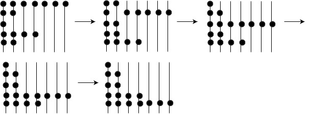
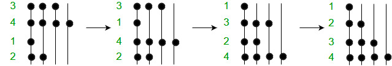

Also known as Gravity sort, this algorithm was inspired by natural phenomena and was designed keeping in mind objects(or beads) falling under the influence of gravity.  
**The Idea**: Positive numbers are represented by a set of beads like those on an abacus.

**Sorting of {7, 2, 1, 4, 2} using Bead Sort. Beads fall down one by one if there is space below.**

1. Like in the image above the beads represent the following numbers from top to bottom : 7, 2, 1, 4, 2. Now, imagine that this is the position of the beads at time t = 0 and with every passing second the beads will fall down by one level provided there is no bead already present below them. In such a case, they just rest upon the bead below them.(Rods are numbered from left to right and levels are numbered from the bottom as 1, 2, ………. n.)
2. Now, at time t = 1 the bottom 2 beads in the first two rods from the left stay at their positions while the second bead from the top from the second rod comes down by one level to rest upon the bead below it. The beads in the 3rd and 4th rod at level 2 come down to level 1. Simultaneously, the beads in the rods 3 to 7 come down by one level. Now, the numbers from top to bottom become: 2, 6, 2, 2, 4.
3. This goes on till time t = 4 where we get the sorted sequence of numbers from top to bottom which is: 1, 2, 2, 4, 7.

#### Why is it called so?
When one tries to visualize this algorithm it appears as if beads are falling down under the influence of gravity to the bottom-most level they can reach resulting the set of beads being arranged in a descending order from the ground up.

**Try to implement it yourself before looking at the code.**

**Time Complexity**: The algorithm’s run–time complexity ranges from O(1) to O(S) (S is the sum of the input integers) depending on the user’s perspective. Finally, three possible implementations are suggested.

O(1) : Dropping all beads together as a single (simultaneous) operation. This complexity cannot be implemented in practice.  
O(n^1^/^2           ): In a realistic physical model that uses gravity, the time it takes to let the beads fall is proportional to the square root of the maximum height, which is proportional to n. 
O(n) : Dropping the row of beads in the frame (representing a number) as a distinct operation since the number of rows is equal to n. 
O(S) : Dropping each and every bead’ as a separate operation since S is the sum of all the beads.