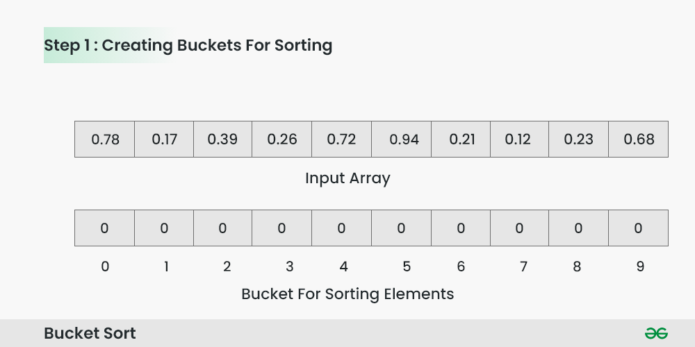
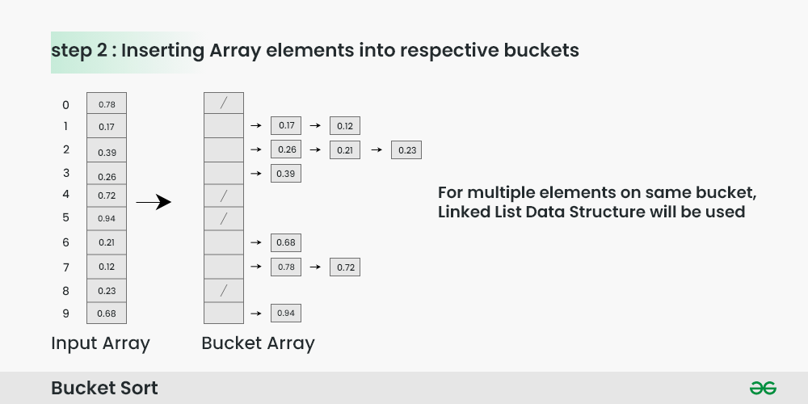
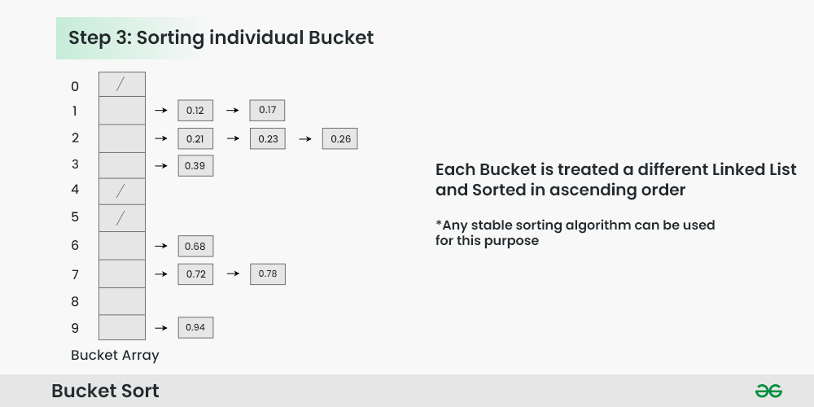
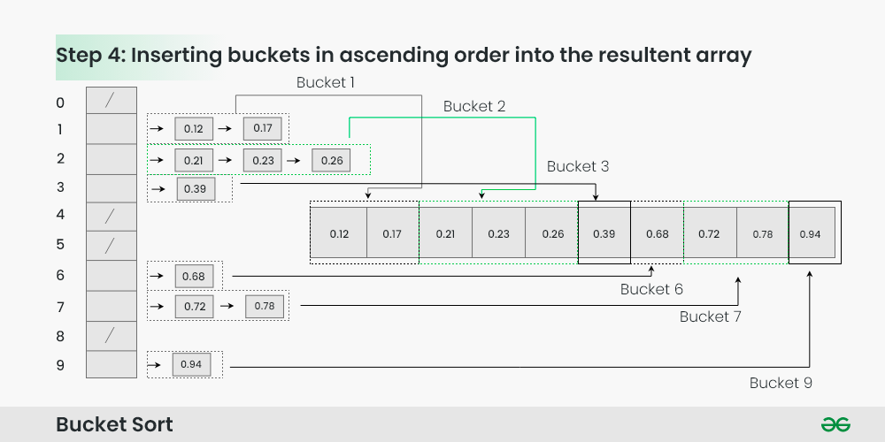
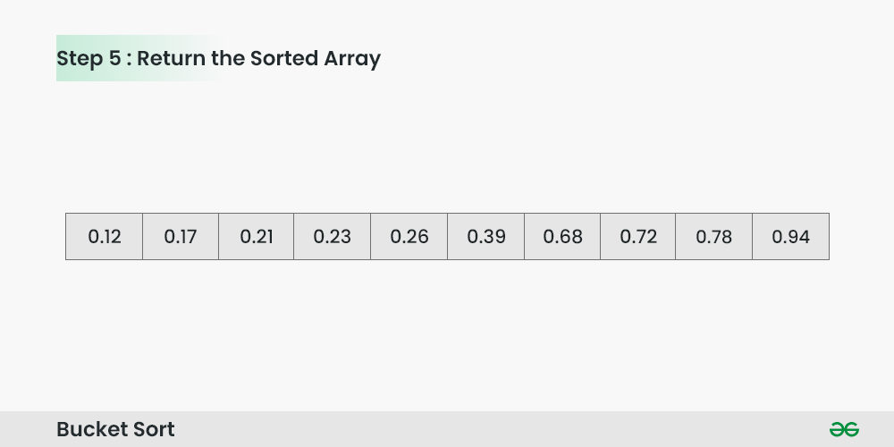

# Bucket Sort
>***Bucket sort** is a sorting technique that involves dividing elements into various groups, or buckets. These buckets are formed by uniformly distributing the elements. Once the elements are divided into buckets, they can be sorted using any other sorting algorithm. Finally, the sorted elements are gathered together in an ordered fashion.*

### Bucket Sort Algorithm:
Create n empty buckets (Or lists) and do the following for every array element arr[i].

Insert arr[i] into bucket[n*array[i]]
Sort individual buckets using insertion sort.
Concatenate all sorted buckets.

### How does Bucket Sort work?
To apply bucket sort on the input array **[0.78, 0.17, 0.39, 0.26, 0.72, 0.94, 0.21, 0.12, 0.23, 0.68]**, we follow these steps:

**Step 1**: Create an array of size 10, where each slot represents a bucket.

 

Creating Buckets for sorting

**Step 2**: Insert elements into the buckets from the input array based on their range.

Inserting elements into the buckets:

* Take each element from the input array.
* Multiply the element by the size of the bucket array (10 in this case). For example, for element 0.23, we get 0.23 * 10 = 2.3.
* Convert the result to an integer, which gives us the bucket index. In this case, 2.3 is converted to the integer 2.
* Insert the element into the bucket corresponding to the calculated index.
* Repeat these steps for all elements in the input array.

Inserting Array elements into respective buckets

**Step 3**: Sort the elements within each bucket. In this example, we use quicksort (or any stable sorting algorithm) to sort the elements within each bucket.

Sorting the elements within each bucket:

* Apply a stable sorting algorithm (e.g., quicksort) to sort the elements within each bucket.
* The elements within each bucket are now sorted.

Sorting individual bucket

**Step 4**: Gather the elements from each bucket and put them back into the original array.

Gathering elements from each bucket:

* Iterate through each bucket in order.
* Insert each individual element from the bucket into the original array.
* Once an element is copied, it is removed from the bucket.
* Repeat this process for all buckets until all elements have been gathered.

Inserting buckets in ascending order into the resultant array

**Step 5**: The original array now contains the sorted elements.

The final sorted array using bucket sort for the given input is [0.12, 0.17, 0.21, 0.23, 0.26, 0.39, 0.68, 0.72, 0.78, 0.94].

Return the Sorted Array

### Complexity Analysis of Bucket Sort Algorithm
#### Time Complexity: O(n2),

* If we assume that insertion in a bucket takes O(1) time then steps 1 and 2 of the above algorithm clearly take O(n) time.
* The O(1) is easily possible if we use a linked list to represent a bucket.
* Step 4 also takes O(n) time as there will be n items in all buckets.
* The main step to analyze is step 3. This step also takes O(n) time on average if all numbers are uniformly distributed.
* Auxiliary Space: O(n+k)