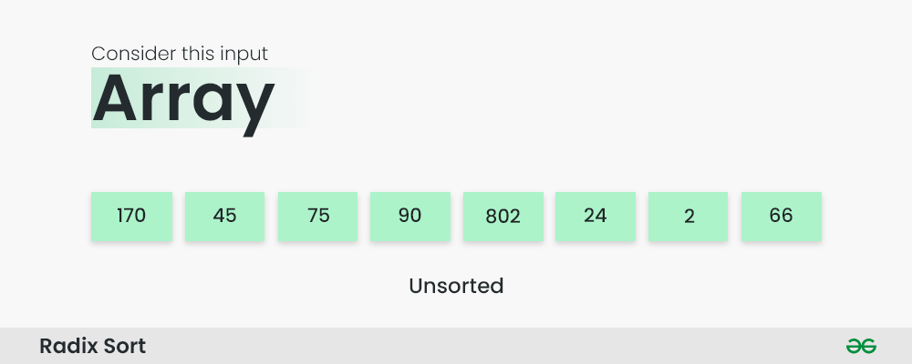
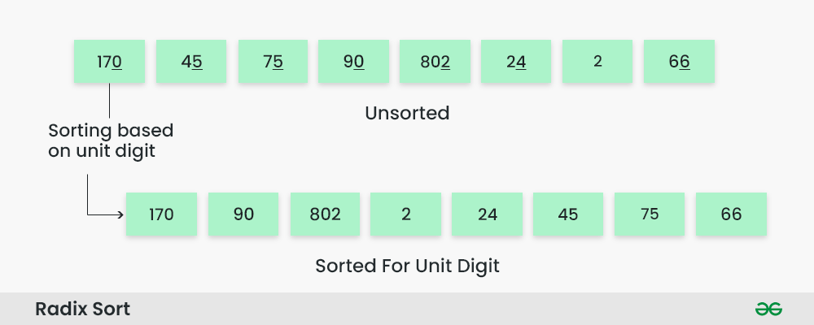
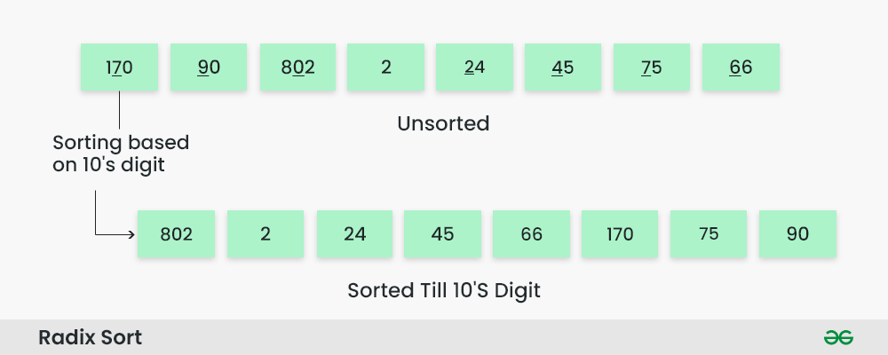
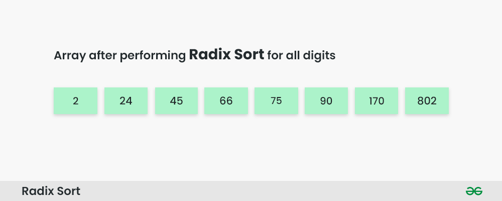

# Radix Sort
>***Radix Sort** is a linear sorting algorithm that sorts elements by processing them digit by digit. It is an efficient sorting algorithm for integers or strings with fixed-size keys.*

Rather than comparing elements directly, Radix Sort distributes the elements into buckets based on each digit’s value. By repeatedly sorting the elements by their significant digits, from the least significant to the most significant, Radix Sort achieves the final sorted order.

### Radix Sort Algorithm
The key idea behind Radix Sort is to exploit the concept of place value. It assumes that sorting numbers digit by digit will eventually result in a fully sorted list. Radix Sort can be performed using different variations, such as Least Significant Digit (LSD) Radix Sort or Most Significant Digit (MSD) Radix Sort.

### How does Radix Sort Algorithm work?
To perform radix sort on the array [170, 45, 75, 90, 802, 24, 2, 66], we follow these steps:

**Step 1**: Find the largest element in the array, which is 802. It has three digits, so we will iterate three times, once for each significant place.

How does Radix Sort Algorithm work | Step 1

**Step 2**: Sort the elements based on the unit place digits (X=0). We use a stable sorting technique, such as counting sort, to sort the digits at each significant place.

**Sorting based on the unit place:**

* Perform counting sort on the array based on the unit place digits.
* The sorted array based on the unit place is [170, 90, 802, 2, 24, 45, 75, 66].

How does Radix Sort Algorithm work | Step 2

**Step 3**: Sort the elements based on the tens place digits.

**Sorting based on the tens place:**

* Perform counting sort on the array based on the tens place digits.
* The sorted array based on the tens place is [802, 2, 24, 45, 66, 170, 75, 90].

* 

How does Radix Sort Algorithm work | Step 3

**Step 4**: Sort the elements based on the hundreds place digits.

**Sorting based on the hundreds place:**

* Perform counting sort on the array based on the hundreds place digits.
* The sorted array based on the hundreds place is [2, 24, 45, 66, 75, 90, 170, 802].

How does Radix Sort Algorithm work | Step 4

**Step 5**: The array is now sorted in ascending order.

The final sorted array using radix sort is [2, 24, 45, 66, 75, 90, 170, 802].

How does Radix Sort Algorithm work | Step 5

### Complexity Analysis of Radix Sort:
#### Time Complexity:

* Radix sort is a non-comparative integer sorting algorithm that sorts data with integer keys by grouping the keys by the individual digits which share the same significant position and value. It has a time complexity of O(d * (n + b)), where d is the number of digits, n is the number of elements, and b is the base of the number system being used.
* In practical implementations, radix sort is often faster than other comparison-based sorting algorithms, such as quicksort or merge sort, for large datasets, especially when the keys have many digits. However, its time complexity grows linearly with the number of digits, and so it is not as efficient for small datasets.

#### Auxiliary Space:

* Radix sort also has a space complexity of O(n + b), where n is the number of elements and b is the base of the number system. This space complexity comes from the need to create buckets for each digit value and to copy the elements back to the original array after each digit has been sorted.